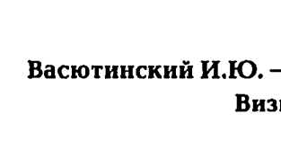
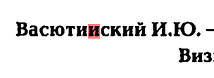
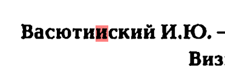
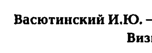

# [jbig2 encoder](https://github.com/agl/jbig2enc) samples.

**jbig2enc** is JBIG2 opensource encoder for bi-level (1 bpp) images.

It uses [Leptonica](http://www.leptonica.org/) library (and its dependancies) for compression.

## Example of applying different weights

| Used parameters     | Image                                                |
| ------------------- | ---------------------------------------------------- |
| original / no JBIG2 |   |
| `-t 0.85 -w 0.25`   |  |
| `-t 0.85 -w 0.50`   |  |
| `-t 0.85 -w 0.75`   |  |

See [this discussion](https://github.com/agl/jbig2enc/commit/f1edbd89944910672d6759aecb999f9c34132e98#commitcomment-150178928) for more details.
